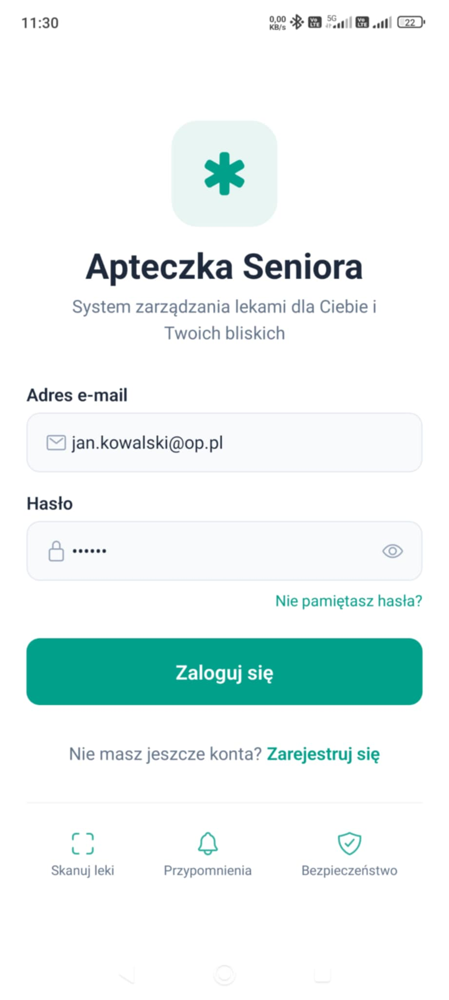
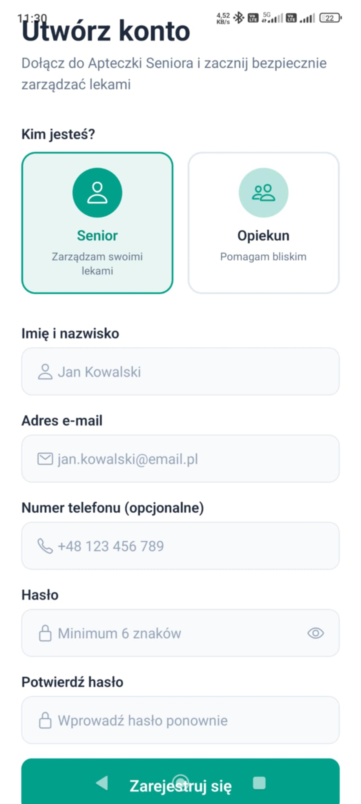
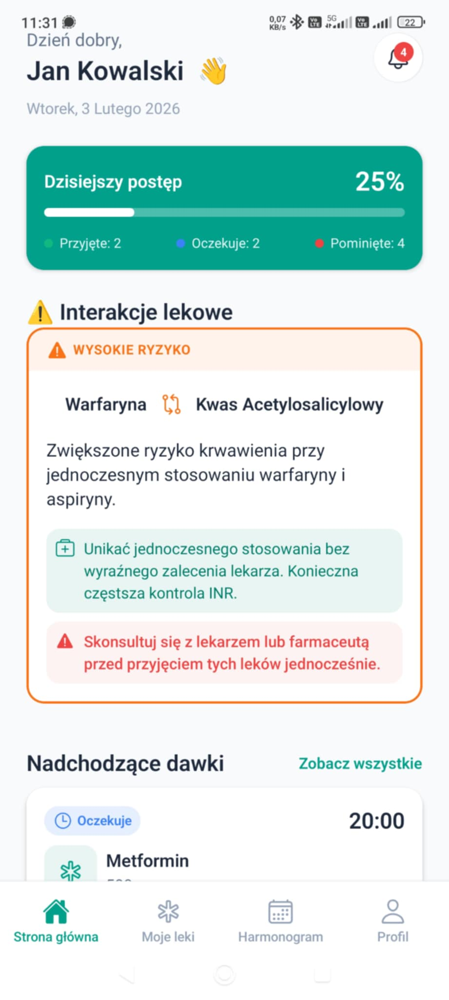
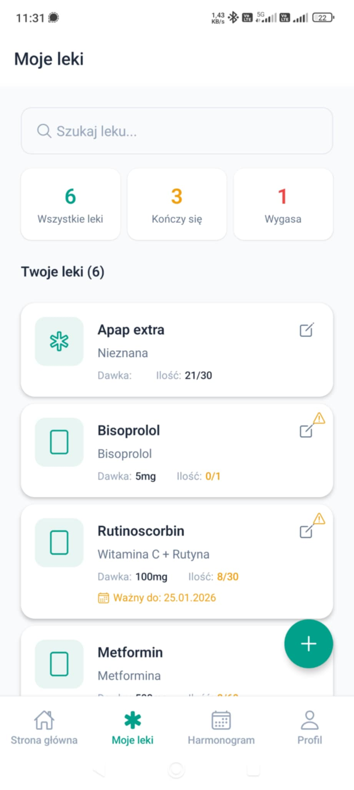
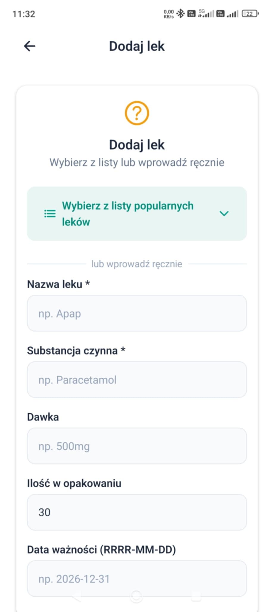
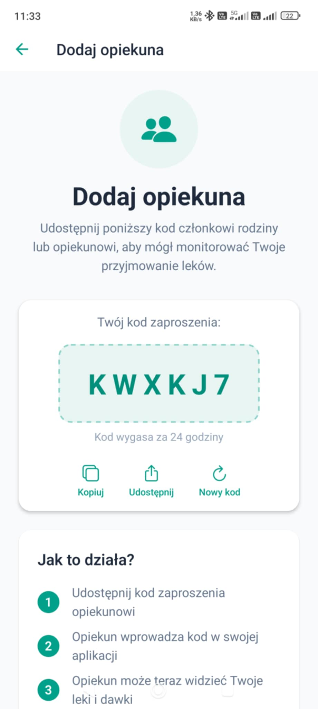
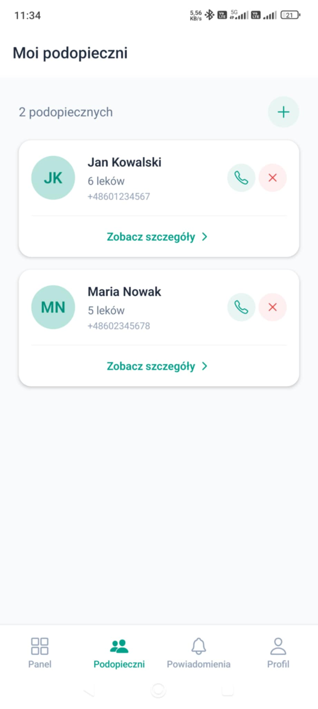
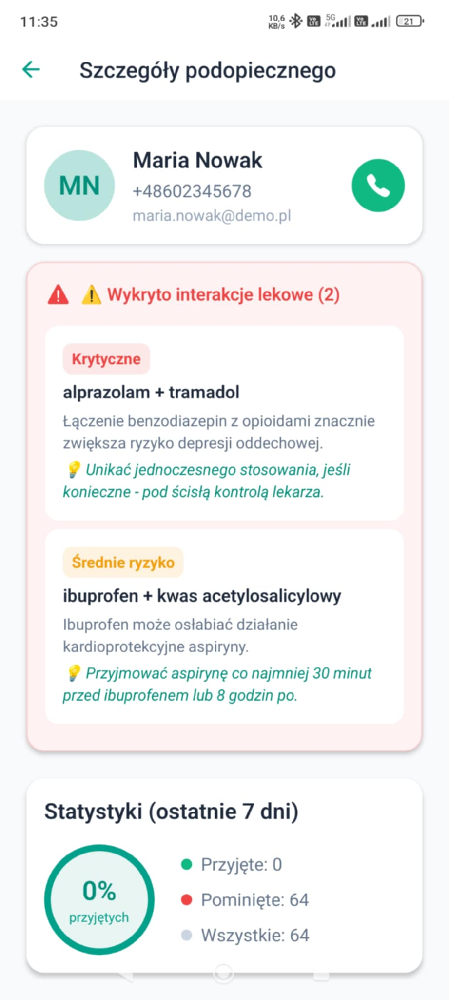
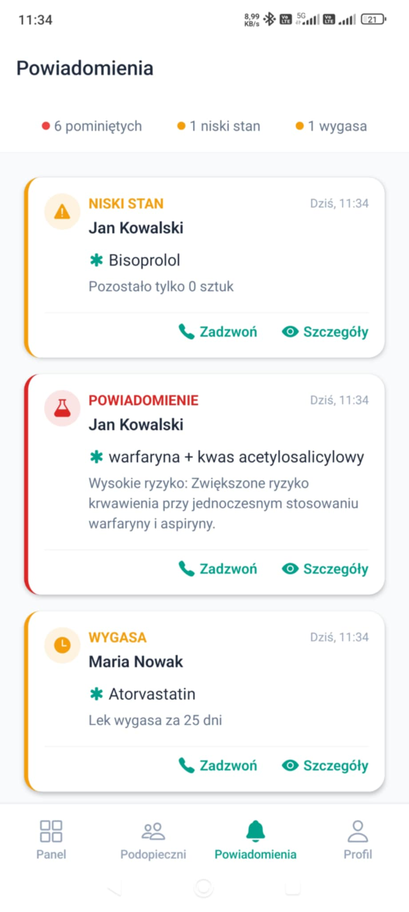

# Apteczka Seniora - System Zarządzania Lekami

Aplikacja mobilna React Native pomagająca osobom starszym i ich opiekunom w zarządzaniu przyjmowaniem leków.

## 📱 Funkcje

### Dla Seniora
- **Skanowanie kodów kreskowych** - szybkie dodawanie leków przez skan
- **Przypomnienia o dawkach** - powiadomienia push o nadchodzących dawkach
- **Historia przyjęć** - śledzenie kiedy leki zostały przyjęte
- **Wykrywanie interakcji** - ostrzeżenia o niebezpiecznych połączeniach leków

### Dla Opiekuna
- **Monitorowanie podopiecznych** - podgląd czy senior przyjął leki
- **Alerty o pominięciach** - powiadomienia gdy dawka została pominięta  
- **Szybki kontakt** - możliwość zadzwonienia do seniora

## 📸 Galeria

### 🔐 Logowanie i Profil
<table align="center">
  <tr>
    <td align="center" width="25%">
      
      <br/><b>Logowanie</b><br/>Bezpieczny dostęp do konta
    </td>
    <td align="center" width="25%">
      
      <br/><b>Rejestracja</b><br/>Szybkie tworzenie konta
    </td>
    <td align="center" width="25%">
      
      <br/><b>Profil Użytkownika</b><br/>Zarządzanie danymi
    </td>
    <td align="center" width="25%">
      
      <br/><b>Powiadomienia</b><br/>Alerty i przypomnienia
    </td>
  </tr>
</table>

### 💊 Aplikacja Seniora
<table align="center">
  <tr>
    <td align="center" width="25%">
      
      <br/><b>Pulpit Seniora</b><br/>Najbliższe dawki i powiadomienia
    </td>
    <td align="center" width="25%">
      
      <br/><b>Harmonogram</b><br/>Dzienny plan przyjmowania leków
    </td>
    <td align="center" width="25%">
      
      <br/><b>Lista Leków</b><br/>Cyfrowa apteczka
    </td>
    <td align="center" width="25%">
      
      <br/><b>Dodawanie Leku</b><br/>Dodaj nowy lek do apteczki
    </td>
  </tr>
  <tr>
    <td align="center">
      
      <br/><b>Pulpit - Przewinięty</b><br/>Więcej opcji i informacji
    </td>
    <td align="center">
      
      <br/><b>Dodaj Opiekuna</b><br/>Połącz się z opiekunem
    </td>
  </tr>
</table>

### 👨‍⚕️ Strefa Opiekuna
<table align="center">
  <tr>
    <td align="center" width="25%">
      
      <br/><b>Lista Podopiecznych</b><br/>Zarządzanie wieloma seniorami
    </td>
    <td align="center" width="25%">
      
      <br/><b>Panel Monitoringu</b><br/>Status realizacji dawek
    </td>
    <td align="center" width="25%">
      
      <br/><b>Szczegóły i Statystyki</b><br/>Historia i realizacja dawek
    </td>
    <td align="center" width="25%">
      
      <br/><b>Alerty Opiekuna</b><br/>Powiadomienia o problemach
    </td>
  </tr>
  <tr>
    <td align="center">
      
      <br/><b>Dodaj Podopiecznego</b><br/>Dodaj nowego seniora do opieki
    </td>
  </tr>
</table>

## 🚀 Uruchomienie projektu

### Wymagania
- Node.js 18+
- npm lub yarn
- Expo CLI
- Konto Firebase (do konfiguracji backendu)

### Instalacja

```bash
# Klonowanie repozytorium
cd apteczka-seniora

# Instalacja zależności
npm install

# Uruchomienie w trybie deweloperskim
npm start
```

### Konfiguracja Firebase

1. Utwórz projekt w [Firebase Console](https://console.firebase.google.com/)
2. Włącz Authentication (Email/Password)
3. Utwórz bazę Firestore
4. Skopiuj konfigurację do pliku `.env`:

```env
EXPO_PUBLIC_FIREBASE_API_KEY=your_api_key
EXPO_PUBLIC_FIREBASE_AUTH_DOMAIN=your_project.firebaseapp.com
EXPO_PUBLIC_FIREBASE_PROJECT_ID=your_project_id
EXPO_PUBLIC_FIREBASE_STORAGE_BUCKET=your_project.appspot.com
EXPO_PUBLIC_FIREBASE_MESSAGING_SENDER_ID=123456789
EXPO_PUBLIC_FIREBASE_APP_ID=1:123456789:web:abcdef
```

## 📁 Struktura projektu

```
src/
├── components/          # Komponenty UI
│   ├── common/          # Button, Input, Card
│   ├── medication/      # MedicationCard, InteractionAlert
│   └── reminders/       # DoseCard
├── screens/             # Ekrany aplikacji
│   ├── auth/            # Login, Register
│   ├── senior/          # Dashboard, Medications, Schedule, Scan
│   └── caregiver/       # MonitoringDashboard
├── navigation/          # React Navigation
├── services/            # Logika biznesowa
│   ├── api/             # Firebase operations
│   ├── barcode/         # Skanowanie kodów
│   ├── notifications/   # Push notifications
│   └── interactions/    # Sprawdzanie interakcji
├── store/               # Zustand state management
├── constants/           # Theme, colors, constants
├── types/               # TypeScript types
└── config/              # Firebase config
```

## 🔧 Technologie

- **React Native** + **Expo** - framework mobilny
- **Firebase** - backend (Auth, Firestore)
- **Zustand** - zarządzanie stanem
- **React Navigation** - nawigacja
- **Expo Camera** - skanowanie kodów
- **Expo Notifications** - powiadomienia push

## 📋 API Leków

Aplikacja używa:
- Lokalnej bazy popularnych polskich leków
- OpenFDA API jako fallback dla międzynarodowych leków

## ⚠️ Interakcje Lekowe

Wbudowana baza reguł zawiera popularne interakcje lekowe z poziomami ryzyka:
- 🟢 **Niskie** - niewielkie ryzyko
- 🟡 **Średnie** - wymaga uwagi
- 🟠 **Wysokie** - konsultacja z lekarzem
- 🔴 **Krytyczne** - nie łączyć

## 📲 Budowanie aplikacji

```bash
# Android APK
npx expo build:android

# iOS (wymaga konta Apple Developer)
npx expo build:ios

# Lub z EAS Build
npx eas build --platform all
```


